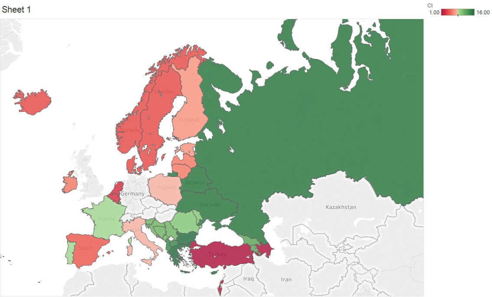
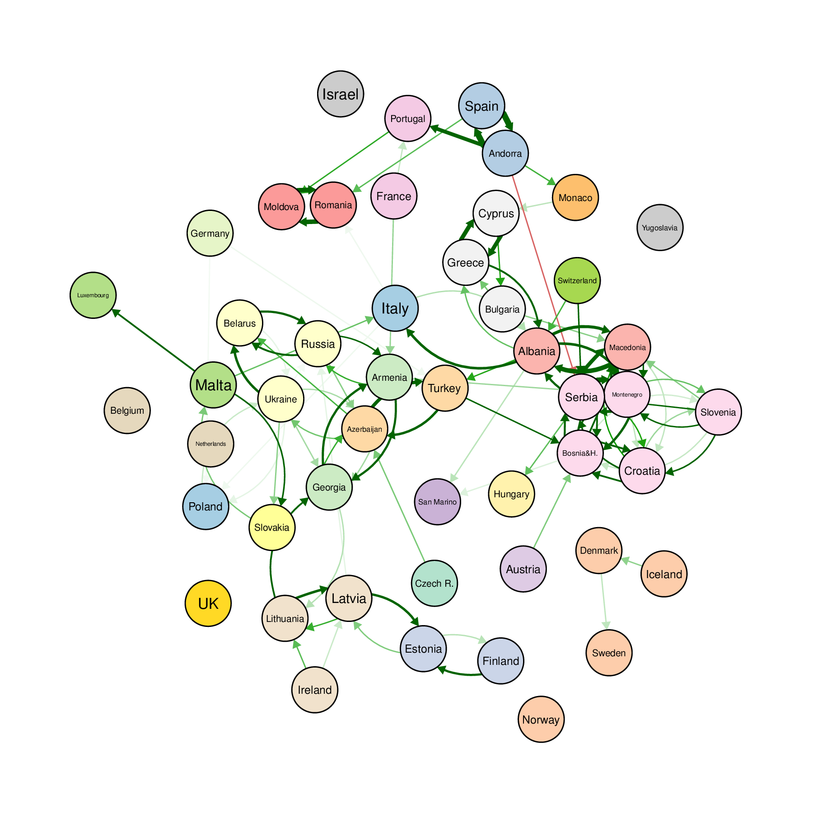
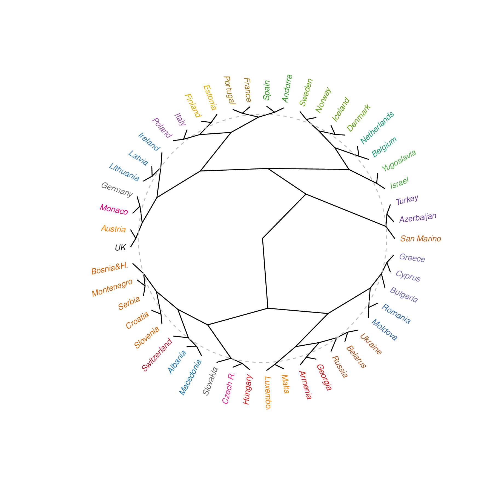
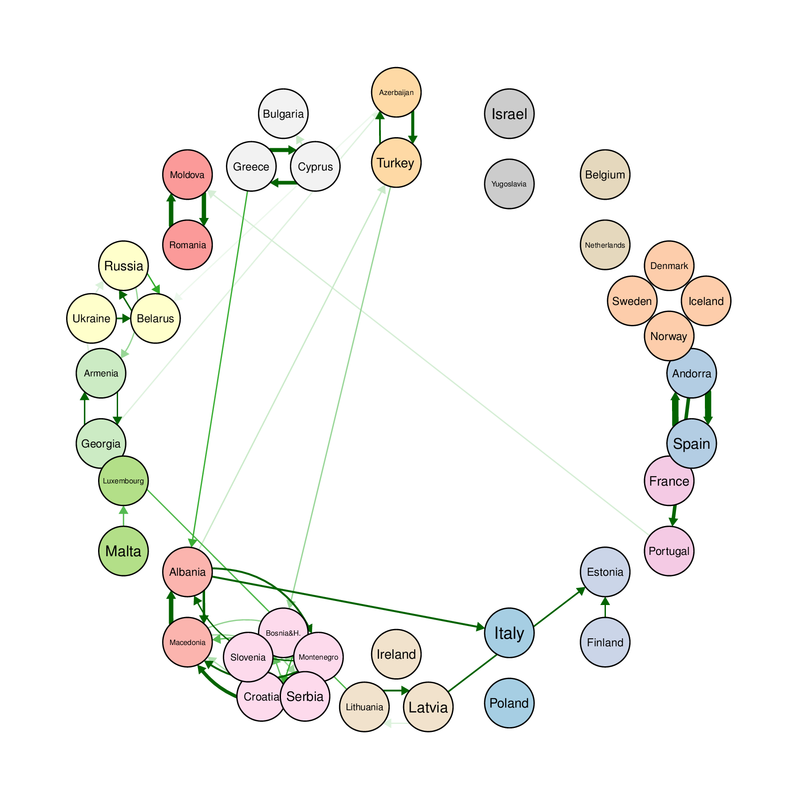
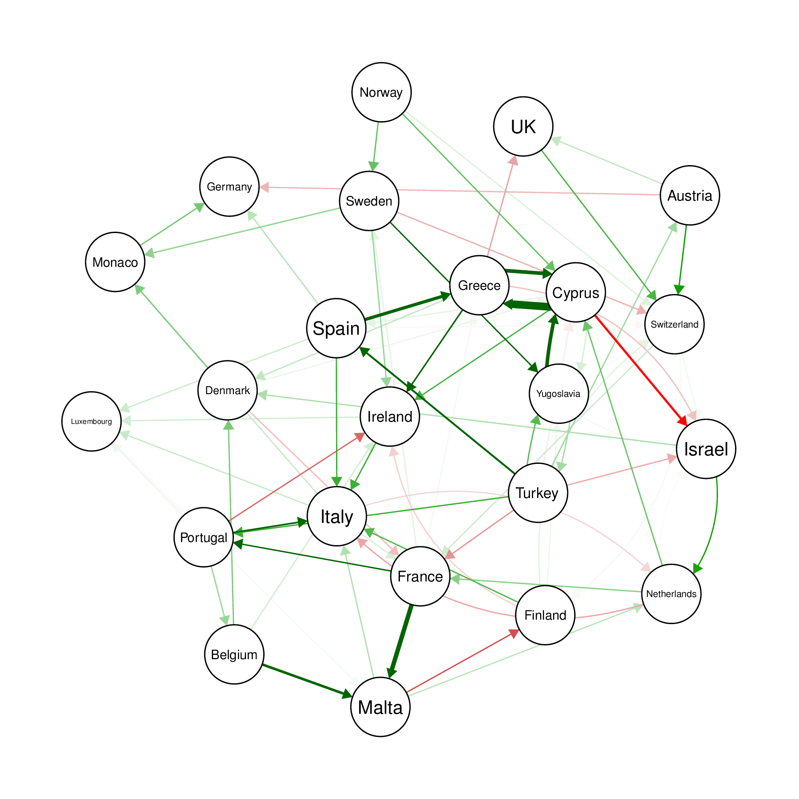
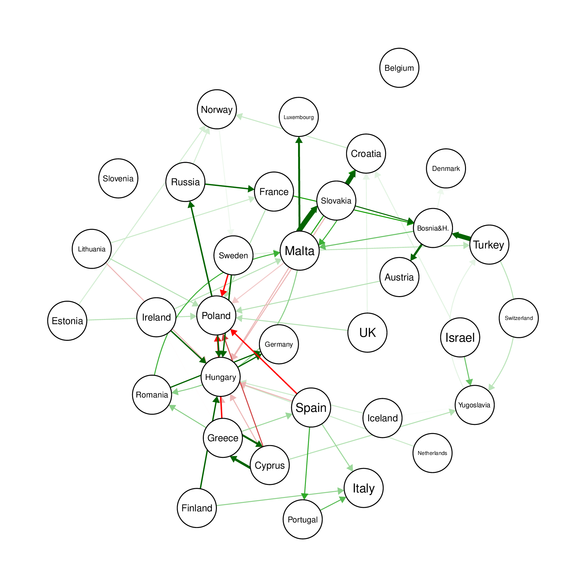
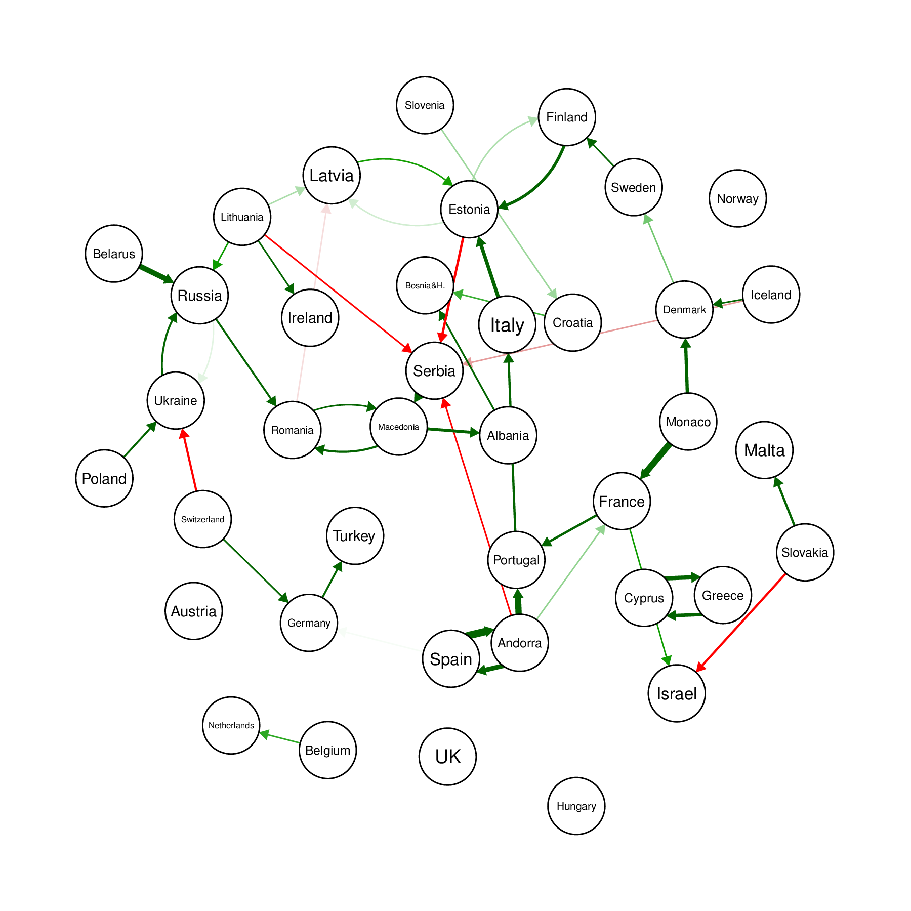
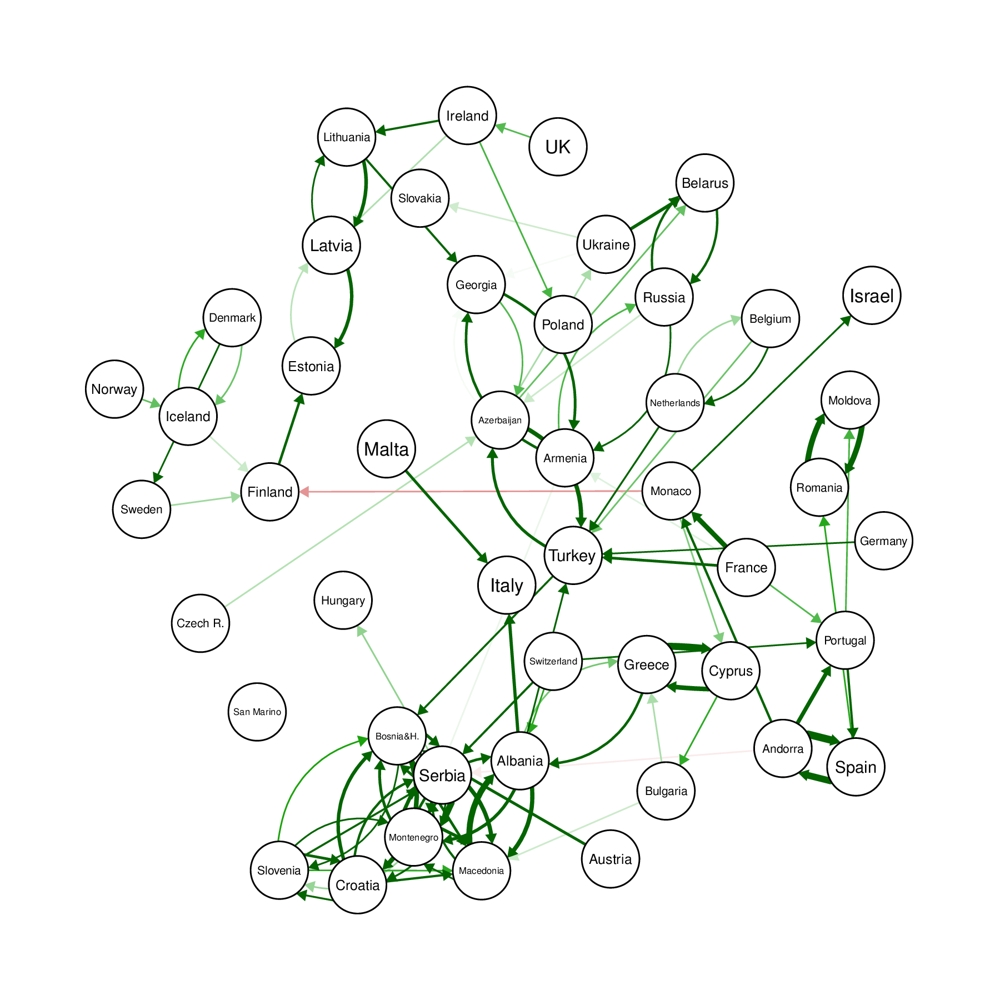
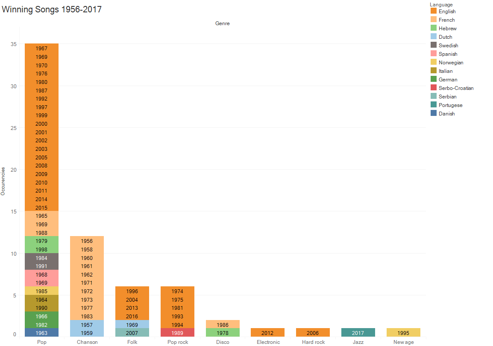
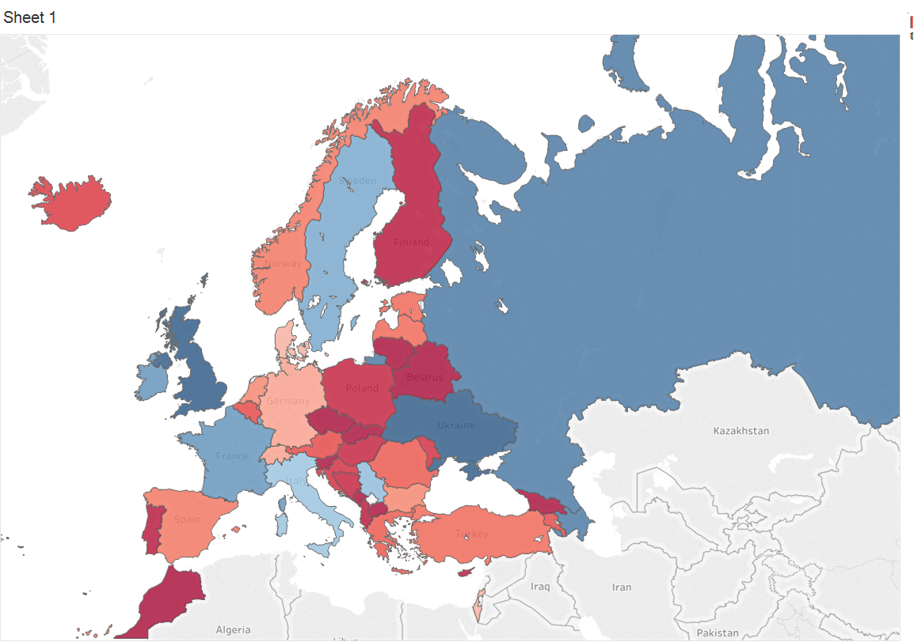

- [Eurovision mining](#eurovision-mining)
- [Voting biases analysis](#voting-biases-analysis)
- [Historical clustering data](#historical-clustering-data)
- [Genres and languages](#genres-and-languages)
- [Measure of success](#measure-of-success)
- [Repository contents](#repository-contents)
- [Data sources](#-data-sources--sourcetxt-)

# Eurovision mining

A project by Artem Mateush, Oleksandr Cherednychenko, Gerson Noboa and Vasiliy Skydanienko, made for University of Tartu [Data Mining](https://courses.cs.ut.ee/2017/dm/spring) course. 

 *pic. 1. Map of voting biases*
### **[Interactive map](https://public.tableau.com/profile/oleksandr1000#!/vizhome/shared/TTGSHH6FP)**

# Voting biases analysis
We analyzed the voting data in Eurovision Song Contests 1975-2017 (semifinals and finals;  jury and televoting included) to find out the underlying geopolitical and cultural biases influencing the votes.
 
To analyze the biases in voting patterns we calculate a bias score for each vote as the square of a difference between the vote and average vote for the receiver country in this year and round. This kind of normalization allows us to factor out the song quality out of the analysis. 
 
We then average the score over all years, discarding countries with low participation counts (Australia, Morocco), and visualize the strongest relations (pic. 2) to get insight into interactions between countries.

 *pic. 2. Graph of voting biases*
 
We can already see ex-USSR, Nordic, Baltic, Balkan and Iberian (Portugal, Spain, Andorra) regions clustering together, having a strong bias for each other.
 *pic. 3. Graph of **negative** voting biases*

We can also discern a couple of strong negative biases between countries. (pic. 3) shows that Armenia and Azerbaijan have strong mutual negative votes (reflecting the Nagorno-Karabakh conflict) and Turkey-Serbia votes.
 
To further separate the distinct clusters, we reconstructed relations into a distance matrix (choosing maximum absolute bias from a pair to achieve symmetry and equalling maximal bias to zero distance). We then applied a hierarchical clustering algorithm, which is visualized on a dendrogram (pic. 4).
 *pic. 4. Dendrogram of hierarchical clustering*

It split the data into 25 clusters, 16 of which are non-trivial (have more than 1 country) and are shown on the map (pic. 1) and on the cluster diagram (pic. 5).
 *pic. 5. Countries clustered by bias*

 
The Nordic block is in top right corner, Iberian block — on the right side, Baltics - in bottom side, Balkans — in bottom left corner, post-soviet — on the left side. The observed pairs with a strong positive bias for each other include Greece-Cyprus, Romania-Moldova, Andorra-Spain, Azerbaijan-Turkey, etc.

# Historical clustering data

We built same graphs for distinct time periods: 1975-1984; 1985-1994; 1995-2004; 2005-2017. They are featured below:
 *pic. 6. Graph of voting biases 1975-1984*

 *pic. 7. Graph of voting biases 1985-1994*

 *pic. 8. Graph of voting biases 1995-2004*

 *pic. 9. Graph of voting biases 2005-2017*

# Genres and languages 

The world is changing, music is changing. But is it the case with Eurovision? Well, not exactly. The pallet of genres is quite conservative,  and  Pop is a non-contested leader across eras and languages. Chanson, on its turn, is predominantly french-related and lost in popularity after the 1970s. It should also be noted that last 20 years, marked by the abolishment of the native-language rule, have witnessed the emergence of non-traditional genres such as Hard Rock (Finland, 2006) and Jazz (Portugal, 2017).
 *pic. 10. Languages and genres dynamics over the years*

### **[Interactive visualisation](https://public.tableau.com/profile/oleksandr1000#!/vizhome/EurovisionGenres/Dashboard1)**

# Measure of success 
 
52 countries have participated in Eurovision since 1956. Were some of them more successful? Probably so, but is there a one comprehensive metrics to measure overall proficiency? We decided to quantify the overall performance of each country based on the number of top 5 places obtained over the years, with the total amount of entries taken into consideration.  It can be seen that best performers are in fact grouped in clusters, and three distinct clusters could be identified. Ukraine, Russia, and Azerbaijan clearly being top performers among post-Soviet countries,  Serbia being the top contender in the Balkans region, Sweden holding leadership position across Nordics and Baltics and a cluster of 4 countries – Ireland, United Kingdom, Italy, and France are the leaders in Western Europe.  It is interesting that both veterans and novices in terms of debut year are represented among top contestants, with United Kingdom (1957 expert) being overall first and Ukraine (2003 newcomer) being second in ranking.

 *pic. 11. Map of success*

### **[Interactive map](https://public.tableau.com/views/SuccessStory/ParticipantsSuccess?:embed=y&:display_count=yes)**

# Repository contents
* [Eurovision.html](Eurovision.html) — rendering of the Jupyter Notebook [Eurovision.ipynb](Eurovision.ipynb) used for the analysis
* [pics/png/](pics/png/), [pics/vector/](pics/vector/) - renderings of different pictures produced
* [tableau_maps](tableau_maps/) — source files for maps and "Genres and languages", use [Tableau Reader](https://www.tableau.com/products/reader) to see;
* [excel/](excel/) — processed source files and files for Tableau visualisations

# [Data sources](Source.txt)
1. https://eurovision.tv/history/full-split-results

2. https://data.world/datagraver/eurovision-song-contest-scores

3. https://eurovision.tv/history/full-split-results

4. https://eurovision.wetransfer.com/downloads/a1da4b5eb0395e58b71016dce076564a20170409152448/6754ae

5. http://eschome.net/databaseoutput108.php

6. http://eschome.net/databaseoutput109.php
